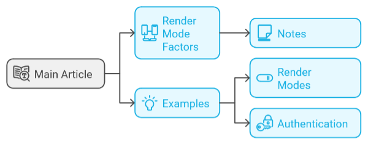

## Blazor für Entwickler
**[English Version](https://github.com/AlexNek/Blazor-for-You/blob/master/ForDevelopers/readme.md)**

### Überblick
In diesem Artikel gehen wir nicht noch einmal auf das grundlegende Blazor-Tutorial ein. Viele Ressourcen decken bereits dieses Thema ab. Stattdessen werden wir uns auf die spezifischen Herausforderungen konzentrieren, die sich Entwicklern bei der Verwendung der neuen Rendering-Modi in .NET 8 und höher stellen können.

Der Artikel ist nicht einfach, weil er eine Menge Informationen enthält, und ich habe versucht, sie aufzuschlüsseln.

Für Beispiele besuchen Sie das [Beispiel-Repository](https://github.com/AlexNek/BlazorNet8PlusExamples). Dort finden Sie auch eine detaillierte [Beschreibung der Beispiele](https://github.com/AlexNek/BlazorNet8PlusExamples/blob/master/readme-de.md). Alternativ können Sie direkt mit den Demos starten: [Demo 1](https://blazornet9rendermodes.azurewebsites.net) oder [Demo 2](https://blazorauthentication202412.azurewebsites.net).

### Einführung in die neuen Render-Modi von Blazor

Blazor hat kürzlich einige coole Updates erhalten, die Entwicklern neue Möglichkeiten bieten, Inhalte in .NET 8 und darüber hinaus zu rendern. Statt sich auf einen starren Ansatz zu beschränken, können Sie nun verschiedene Rendering-Methoden kombinieren, je nach den Anforderungen Ihrer Anwendung.

Lassen Sie uns das aufschlüsseln:  

- **Statisch (SSR)**: Stellen Sie sich dies vor, als ob vorab gerenderte Inhalte direkt an Ihre Benutzer ausgeliefert werden. Der Server sendet vollständig gerendertes HTML, sodass Seiten schnell geladen werden und gut für Suchmaschinen sind. Dies ist ideal für Szenarien, bei denen Geschwindigkeit und SEO am wichtigsten sind, wie z. B. öffentliche Websites oder Blogs.

- **Interaktiv (Server oder Client)**: Wenn Ihre Anwendung reaktionsfähig und dynamisch sein soll, kommt interaktives Rendering ins Spiel. Es beginnt mit der Auslieferung vorab gerenderter Inhalte für ein schnelles Laden, wechselt dann aber zu clientseitigen Updates mithilfe von WebAssembly oder serverseitigen Updates mit Blazor Server. Es ist ideal für Dashboards oder Apps, die eine kontinuierliche Benutzerinteraktion erfordern.  

- **Hybrid (Auto)**: Nicht alles in einer App passt sauber in eine Kategorie, und hier glänzt der hybride Modus. Er kombiniert die Vorteile von SSR und Interaktivität, indem er mit serverseitigem Inhalt für Geschwindigkeit startet und dann bei Bedarf auf clientseitiges Rendering umschaltet. Es ist eine großartige Wahl für Apps, die sowohl Flexibilität als auch Leistung erfordern.

Obwohl diese Modi einen flexiblen Ansatz bieten, der Geschwindigkeit, Interaktivität und Kontrolle kombiniert, erhöhen sie auch die Komplexität der Entwicklung.

## Die richtige Wahl des Modus

Die Entscheidung, wie Ihre App gerendert werden soll, ist nicht nur eine einzelne Wahl – es geht darum, die einzigartigen Anforderungen Ihrer Anwendung zu verstehen. Mit den flexiblen Rendering-Optionen von Blazor können Sie jedem Teil Ihrer Anwendung seinen spezifischen Zweck zuweisen und sowohl die Leistung als auch das Benutzererlebnis sicherstellen.

### Render-Modi auf verschiedenen Ebenen  

Blazor zwingt Sie nicht dazu, eine einzige Rendering-Strategie für die gesamte Anwendung zu verwenden. Stattdessen können Sie es auf drei verschiedenen Ebenen fein abstimmen:

- **Anwendungsebene:** Definieren Sie eine Standard-Rendering-Strategie für die gesamte Anwendung. Wenn beispielsweise die Mehrheit Ihrer Seiten schnelles Laden und starke SEO-Leistung priorisiert, wäre die Übernahme von SSR als globaler Standard eine praktische Wahl. Zusätzlich können Sie Rendering-Ansätze auf anderen Ebenen anpassen, um spezifische Anforderungen zu erfüllen.
 
- **Seitenebene:** Überschreiben Sie die globale Einstellung für bestimmte Seiten. Eine Seite mit komplexer Interaktivität, wie ein Dashboard oder eine Live-Chat-Oberfläche, könnte einen interaktiven Modus verwenden, um Echtzeit-Updates zu gewährleisten.

- **Komponentenebene:** Übernehmen Sie die Kontrolle über einzelne Elemente, indem Sie Render-Modi für spezifische Komponenten zuweisen. Beispielsweise könnte eine Produktseite SSR für das Layout verwenden, jedoch eine interaktive Komponente für den Warenkorb oder den Bewertungsbereich enthalten.

Diese Struktur gibt Ihnen die Möglichkeit, das Verhalten Ihrer App auf jeder Ebene anzupassen und Leistung, Skalierbarkeit und Interaktivität genau dort auszubalancieren, wo sie benötigt werden. 

### Anpassungsfähigkeit der Render-Modi

Blazor bietet die Möglichkeit, zwischen **festen** und **variablen** Render-Modi zu wählen, je nachdem, wie flexibel Ihre App sein soll:

- **Fester Modus:** Bleibt während des gesamten Lebenszyklus der App bei einer einzigen Rendering-Methode – wie SSR oder Interaktiv. Er ist einfach und funktioniert gut für statische Seiten oder Bereiche mit begrenzter Interaktivität.

- **Variabler Modus:** Passt sich dynamisch an und wechselt den Render-Modus je nach dem, was in der App passiert. Eine Produktseite könnte zum Beispiel mit SSR für schnelles Laden und SEO beginnen, aber in den interaktiven Modus wechseln, um Funktionen wie das Hinzufügen von Artikeln zum Warenkorb zu ermöglichen.

Variable Modi sind besonders nützlich für Apps, bei denen verschiedene Teile sehr unterschiedliche Zwecke erfüllen. Bedenken Sie jedoch, dass es entscheidend ist, diese Übergänge reibungslos zu verwalten, um eine nahtlose Benutzererfahrung zu gewährleisten.

### Faktoren bei der Wahl des Modus

Bei der Wahl zwischen SSR und Interaktiv-Modi ist es wichtig, die spezifischen Anforderungen Ihrer Anwendung zu bewerten. Faktoren wie Leistung, Skalierbarkeit, Benutzererfahrung und betriebliche Anforderungen spielen eine entscheidende Rolle bei der Bestimmung des besten Ansatzes. Eine detaillierte Vergleichstabelle dieser Kernmerkmale, die die Fähigkeiten, Einschränkungen und die besten Szenarien für jeden Render-Modus hervorhebt, finden Sie **--> [hier](factors-de.md) <--**.

#### Schneller Vergleich: SSR, Interaktiv und Hybrid Modi
Hier ist eine **Schnellvergleich**-Tabelle, die die wichtigsten Unterschiede zwischen den **SSR**, **Interaktiv** und **Hybrid**-Modi zusammenfasst. 

| Faktor  | SSR (Statische Serverseitige Darstellung) | Interaktiv (Server) | Interaktiv (Client) | Hybrid (Auto)|
|---------|-------------------------------------------|---------------------|---------------------|--------------|
| **Render-Standort**                   | Nur serverseitig                                                 | Server-seitig für Initial Load; Browser-seitig für Interaktivität (via Blazor Server) | Clientseitiges Rendering nach initialem serverseitigem Ladevorgang (via WebAssembly) | Serverseitig für den ersten Ladevorgang; Übergang zu clientseitigem Rendering (WebAssembly oder Blazor Server) nach Bedarf |
| **Erste Ladegeschwindigkeit**        | Schnell (vorab gerenderte HTML direkt gesendet)                   | Mäßig (einrichtung für Interaktivität erforderlich)           | Mäßig (anfängliche WebAssembly Ladezeit, aber danach schnell) | Schnell (anfänglich SSR, dann übernimmt clientseitig)                |
| **Interaktivität**                   | Eingeschränkte Interaktivität (statische Inhalte, bis die clientseitige Verarbeitung ggf. übernommen wird)               | Volle Interaktivität nach dem Laden der clientseitigen Ressourcen (via Blazor Server) | Volle Interaktivität nach dem Laden der clientseitigen Ressourcen (via WebAssembly) | Volle Interaktivität nach dem initialen serverseitigen Ladevorgang, mit Übergang zu clientseitiger Interaktivität |
| **SEO**                              | Ausgezeichnet (vollständig gerenderte Inhalte werden an den Client gesendet)  | Mäßig (dynamische Inhalte erfordern zusätzliche SEO-Behandlung) | Mäßig (dynamische Inhalte erfordern zusätzliche SEO-Behandlung) | Gut (initiales SSR bietet SEO-Vorteil, aber dynamische Inhalte erfordern clientseitige Handhabung) |
| **Statusverwaltung**                | Serverseitig (kein clientseitiger Status)                           | Serverseitig (SignalR für Echtzeit-Updates) | Clientseitig (der Client verwaltet die meisten Status über WebAssembly) | Mischung aus server- und clientseitiger Statusverwaltung (je nach Übergang) |
| **Verwendungsfall**                 | Am besten für statische oder hauptsächlich statische Webseiten (z.B. Blogs, Nachrichten-Websites) | Am besten für Echtzeit-Dashboards, Apps mit hoher Nutzerinteraktivität | Am besten für Single-Page-Apps oder Apps, die clientseitige Interaktivität und Offline-Unterstützung benötigen | Am besten für Apps, die sowohl schnelles Laden als auch dynamische Funktionen benötigen (z.B. E-Commerce) |
| **Skalierbarkeit**                  | Begrenzt durch die Serverkapazität (jede Benutzeranfrage erfordert Serververarbeitung und Ressourcen) | Skaliert besser als SSR, indem die Serverlast mit serverseitiger Interaktivität reduziert wird, aber dennoch auf den Server für dynamische Updates und Socket-Verbindungen für SignalR angewiesen ist | Skaliert sehr gut, da die meisten Verarbeitungen clientseitig erfolgen, was die Serverlast erheblich reduziert | Skaliert gut, insbesondere mit clientseitiger Verarbeitung, nachdem die initiale Seite geladen ist, wodurch die Serverabhängigkeit verringert wird |
| **Offline-Unterstützung**           | Begrenzt (erfordert eine Serververbindung)                        | Begrenzt (abhängig von der Serververbindung für Echtzeit-Interaktionen)     | Volle Unterstützung für clientseitige Verarbeitung mit progressiver Verbesserung  | Anfangs eingeschränkt, dann volle Unterstützung mit clientseitiger progressiver Verbesserung nach dem Übergang.       |

### Entwickler-Fallen: Render-Modus Fallstricke
Manchmal erwarten Entwickler bestimmte Verhaltensweisen, aber die Dinge funktionieren anders. Achten Sie auf diese wichtigen Punkte:

| Feature                    | SSR (Statische Serverseitige Darstellung) | Interaktiv (Server)  | Interaktiv (Client)   |
|----------------------------|-------------------------------------------|----------------------|-----------------------|
| **OnInitializedAsync**      | Einmal aufgerufen                        | Zweimal aufgerufen: einmal während der Vorab-Darstellung und einmal beim Übergang zur Interaktivität | Zweimal aufgerufen: einmal während der Vorab-Darstellung und einmal beim Übergang zur Interaktivität |
| **OnAfterRenderAsync**      | Nicht aufgerufen                         | Sofort nach der Server-Darstellung aufgerufen | Sofort nach der Client-Darstellung aufgerufen |
| **HttpContext Zugriff**     | Vollständig verfügbar während der serverseitigen Vorab-Darstellung | Auf serverseitige Logik beschränkt | Nicht verfügbar |
| **NavigationManager**       | Beschränkt auf serverseitige Navigation   | Vollständig unterstützt für SPA-ähnliches Verhalten | Vollständig unterstützt für SPA-ähnliches Verhalten |
| **JavaScript Interop** | Eingeschränkt (statisches JS möglich, keine dynamische Interop) | Verfügbar nach dem anfänglichen Laden (über SignalR) | Vollständig verfügbar (nach WASM-Laden) | 
| **RenderFragment**          | Nur statisch während SSR                  | Vollständig unterstützt für Seiten- und anwendungsweite Render-Modi | Vollständig unterstützt für Seiten- und anwendungsweite Render-Modi |
| **Fehlerbehandlung**        | Zeigt Fallback-Inhalte oder Fehlerseiten an | Erfordert benutzerdefinierte Fehlergrenzen | Erfordert benutzerdefinierte Fehlergrenzen |
| **DOM-Aufräumaufgaben**     | Möglicherweise benutzerdefinierte Handhabung erforderlich, da das DOM während der Entsorgung möglicherweise nicht existiert | Vollständig unterstützt | Vollständig unterstützt |

**Anmerkung:**
- **Prerendering in interaktiven Modi**: In den Modi **Hybrid** und **Interaktiv (Server)** ist das **serverseitige Prerendering** standardmäßig aktiviert. Das bedeutet, dass die Komponente zuerst serverseitig als statisches HTML gerendert wird. Sobald WebAssembly oder Blazor Server auf der Client-Seite geladen ist, wird die Komponente interaktiv und neu initialisiert. Dies führt dazu, dass **`OnInitializedAsync` zweimal aufgerufen wird**: einmal während des **serverseitigen Prerenderings** und erneut, wenn die App auf der Client-Seite zur Interaktivität übergeht.
 
### Wahl des richtigen Modus - Zusammenfassung
Die Wahl des richtigen Rendering-Modus in Blazor ist eine komplexe Entscheidung, die eine sorgfältige Abwägung verschiedener Faktoren erfordert. Während die Tabellen, die zuvor in diesem Kapitel bereitgestellt wurden, detaillierte Vergleiche zu verschiedenen Aspekten bieten, ist es wichtig zu bedenken, dass es keine „One-Size-Fits-All“-Lösung gibt. Der beste Ansatz besteht häufig darin, eine Kombination von Rendering-Modi zu wählen, die den spezifischen Anforderungen Ihrer Anwendung entspricht. Berücksichtigen Sie Faktoren wie SEO, Leistung und Interaktivitätskomplexität.

Denken Sie daran, dass Blazor Ihnen ermöglicht, Rendering-Modi innerhalb einer einzigen Anwendung zu mischen und anzupassen. Beginnen Sie damit, Ihre Anwendung in Komponenten zu unterteilen und herauszufinden, welche Interaktivität benötigen und welche statisch bleiben können. Dieser Prozess kann eine Iteration erfordern, um das optimale Gleichgewicht zu finden.

#### Beispielanwendungsfälle
| Szenario                      | Empfohlener Modus                    |
|-------------------------------|--------------------------------------|
| Blog- oder Nachrichtenseite    | SSR                                  |
| Echtzeit-Dashboard             | Interaktiv                          |
| E-Commerce-Produktseiten       | SSR für Katalog, Interaktiv für Warenkorb |
| Single-Page-App (SPA)          | Interaktiv                          |
| Hybrid-Anwendung               | Variabel (SSR zu Interaktiv)         |

## Komponenten- und Service-Platzierung
Bei der Entwicklung einer Blazor-Anwendung ist es entscheidend, wo Komponenten und Dienste platziert werden, um optimale Leistung und Sicherheit zu gewährleisten. Die Platzierung dieser Elemente sollte sorgfältig bedacht werden, um sicherzustellen, dass Ihre Anwendung effizient läuft und die erforderlichen Sicherheitsanforderungen erfüllt werden.

### Komponentenplatzierung

Bei der Entscheidung, wo Komponenten in einer Blazor-Anwendung platziert werden sollen, sollte zunächst der ausgewählte Rendering-Modus berücksichtigt werden. Die folgende Tabelle fasst die geeigneten Platzierungen für verschiedene Komponententypen zusammen:

| Komponententyp                | Server  | Client | Shared  |
|-------------------------------|---------|--------|---------|
| **Server-spezifische Logik**   | **Ja**: Auf dem Server platzieren für sichere Verarbeitung und Zugriff auf Server-Ressourcen. | **Nein**: Nicht geeignet für den Client, da es auf Serverlogik angewiesen ist. | **Nein**: Nur im Server-Kontext relevant. |
| **Interaktive UI-Elemente**    | **Ja**: SSR und Interaktive Server-Rendering-Modi. | **Ja**: Interaktives Client und Interaktiver Auto-Modus. | **Ja**: Komponenten ohne Rendering-Modus-Definition. Kann per Instanz definiert werden. |
| **Datenzugriffs-Komponenten**  | **Ja**: Empfohlen für Sicherheit und direkten Zugriff auf Datenbanken. | **Ja (mit Vorsicht)**: Nur verwenden, wenn Daten sicher ohne Offenlegung sensibler Informationen abgerufen werden können. | **Ja**: Kann geteilt werden, wenn es in beiden Modi verwendet wird, jedoch sollten Sicherheitspraktiken beachtet werden. |
| **Authentifizierungs-Komponenten** | **Ja**: Essentiell für das sichere Verwalten von Benutzersitzungen auf dem Server. | **Nein**: Client-seitige Authentifizierung sollte vorsichtig gehandhabt werden, um die Offenlegung sensibler Daten zu vermeiden. | **Begrenzt**: Gemeinsame Komponenten können die Authentifizierung verwalten, sollten jedoch Sicherheit priorisieren. |

**Anmerkung**:
1. **Datenzugriffsstrategie**:
   - Bewerten Sie, wo Ihre Daten gespeichert sind und wie sie abgerufen werden; platzieren Sie Datenzugriffs-Komponenten auf dem Server, wenn Sicherheit Priorität hat.
   - Wenn APIs verwendet werden, prüfen Sie, ob diese APIs sicher vom Client aus zugänglich sind.

2. **Geteilte Logik**:
   - Für Komponenten, die in beiden Umgebungen funktionieren müssen, stellen Sie sicher, dass sie so gestaltet sind, dass sie mit Unterschieden im Ausführungskontext umgehen können (z. B. Zugriff auf Dienste oder APIs).

3. **Statische Komponenten**:
   - Komponenten ohne Rendering-Modus (Standard SSR) und ohne spezifische Dienstverbindung können überall platziert werden.

### Service-Platzierung

Bei der Entwicklung einer Blazor-Anwendung spielt auch die Platzierung und Registrierung von Diensten eine wichtige Rolle.

#### Server-seitige Dienste
Server-seitige Dienste eignen sich hervorragend für die sichere Handhabung sensibler Daten und Geschäftslogik. Diese Dienste sollten immer auf dem Server registriert werden, um die Exposition gegenüber potenziellen Sicherheitslücken zu minimieren. Sie können Aufgaben wie Authentifizierung, Datenzugriff und alle Operationen verwalten, die eine sichere Verarbeitung erfordern.

**Prerendering-Berücksichtigung:** Bei der Verwendung von Prerendering sollten Sie daran denken, dass server-seitige Dienste während der initialen Rendering-Phase verfügbar sind. Client-seitige Dienste hingegen sind zu diesem Zeitpunkt nicht verfügbar, weshalb Sie für Ihre Client-Komponenten die server-seitige Version von Client-Diensten registrieren müssen.

#### Transiente und Scoped Dienste
Transiente und Scoped Dienste können je nach Bedarf entweder auf dem Server oder dem Client registriert werden:

- **Server-Registrierung:** Wenn diese Dienste für Operationen verwendet werden, die Datenzugriff erfordern oder eine sichere Handhabung von Benutzerdaten benötigen, sollten sie auf dem Server registriert werden.
- **Client-Registrierung:** Wenn die Dienste nur für Client-seitige Interaktionen benötigt werden (z. B. UI-Zustandsverwaltung), können sie auf dem Client registriert werden.

Diese Flexibilität ermöglicht es Entwicklern, die Ressourcennutzung zu optimieren und sicherzustellen, dass jeder Dienst dort platziert wird, wo er am effektivsten ist.

#### Singleton-Dienste
Singleton-Dienste sollten idealerweise auf dem Server registriert werden, um eine einzelne Instanz während des gesamten Lebenszyklus der Anwendung aufrechtzuerhalten. Dieser Ansatz gewährleistet ein konsistentes Verhalten über Sitzungen hinweg und reduziert den Overhead, indem er mehrere Instanzen desselben Dienstes vermeidet.

**Client-Betrachtung:** Die Registrierung von Singleton-Diensten auf dem Client wird im Allgemeinen nicht empfohlen, da dies zu Problemen mit der Zustandsverwaltung führen kann. Wenn Sie einen gemeinsamen Zustand in verschiedenen Teilen Ihrer Anwendung benötigen, sollten Sie stattdessen einen server-seitigen Singleton in Betracht ziehen.

#### Singleton-Dienste und Rendering-Übergänge

In Blazor werden **Singleton-Dienste** verwendet, um eine einzige Instanz während des gesamten Lebenszyklus der Anwendung beizubehalten. Sie verhalten sich jedoch unterschiedlich, wenn zwischen verschiedenen Rendering-Modi gewechselt wird, beispielsweise vom serverseitigen Rendering (SSR) zum clientseitigen Rendering (WebAssembly).

- **Während des ersten Renderings:** Wenn eine Blazor-Komponente zum ersten Mal auf dem Server gerendert wird, sind **auf dem Server registrierte Singleton-Dienste** verfügbar. Dies hilft, gemeinsam genutzte Ressourcen wie Authentifizierung oder Protokollierung über verschiedene Komponenten hinweg beizubehalten.

- **Prerendering-Überlegungen:** Wenn Prerendering aktiviert ist, wird die Komponente zunächst auf dem Server gerendert, bevor sie an den Client gesendet wird. Während dieser Phase können **serverseitige Singleton-Dienste** verwendet werden, aber **clientseitige Dienste** sind erst verfügbar, wenn die Seite vollständig auf dem Client geladen ist. Das bedeutet, dass während der frühen Phase einige Dienste möglicherweise nicht zugänglich sind. Sie müssen sicherstellen, dass Ihre App damit umgehen kann, indem Sie sich auf serverseitige Dienste verlassen, bis der Client bereit ist.

- **Übergang zwischen Rendering-Modi:** Beim Wechsel von SSR zu Interactive Server- oder Interactive Client-Modi sind **serverseitige Singleton-Dienste** im gesamten App verfügbar. Wenn jedoch auf clientseitiges Rendering (z. B. Blazor WebAssembly) gewechselt wird, sind diese serverseitigen Dienste nicht mehr direkt zugänglich. Um mit serverseitigen Daten zu interagieren, müssen Sie APIs oder andere Methoden verwenden.

- **Zustandsverwaltung:** Singleton-Dienste können bei der Verwaltung des App-Zustands helfen, aber Sie müssen sicherstellen, dass der Zustand richtig übertragen oder synchronisiert wird, wenn zwischen serverseitigem und clientseitigem Rendering gewechselt wird. Wenn dies nicht richtig gehandhabt wird, kann der Zustand unsynchronisiert werden, was zu Fehlern oder inkonsistentem Verhalten führen kann.

#### Wichtige Überlegungen für Entwickler

- **Skalierbarkeit und Ressourcennutzung:** Bei der Verwendung von Singleton-Diensten in Blazor Server-Anwendungen mit vielen gleichzeitigen Benutzern müssen Entwickler vorsichtig mit der Ressourcennutzung und der Thread-Sicherheit umgehen. Singleton-Dienste werden von allen Benutzersitzungen gemeinsam genutzt, was zu einem erhöhten Speicherverbrauch und potenziellen Leistungsengpässen führen kann.

- **Thread-Sicherheit:** Da mehrere Benutzer gleichzeitig auf denselben Singleton-Dienst zugreifen können, ist es entscheidend, thread-sichere Praktiken zu implementieren, um Dateninkonsistenzen zu vermeiden.

- **Zustandssynchronisation:** Änderungen, die in einem Singleton-Dienst vorgenommen werden, betreffen alle Benutzer. Entwickler sollten Mechanismen implementieren, um sicherzustellen, dass Zustandsänderungen effektiv über verschiedene Benutzersitzungen hinweg kommuniziert werden.

- **Lebenszyklusmanagement:** Singleton-Dienste bleiben während der gesamten Anwendungslaufzeit bestehen. Eine ordnungsgemäße Bereinigung und Ressourcenverwaltung sind notwendig, um zu vermeiden, dass Ressourcen länger als nötig gehalten werden.

## Hilfreiche Links (Alle Links sind auf Englisch)

- [ASP.NET Core Blazor render modes](https://learn.microsoft.com/en-us/aspnet/core/blazor/components/render-modes?view=aspnetcore-9.0)
- [Blazor .NET 8 Server-side Rendering (SSR)](https://akifmt.github.io/dotnet/2024-01-16-blazor-.net8-server-side-rendering-ssr/)
- [Everything New in .NET 9: The Ultimate Developer's Guide](https://dev.to/bytehide/everything-new-in-net-9-the-ultimate-developers-guide-331e)
- [Blazor and .NET 8: How I Built a Fast and Flexible Website](https://jeffreyfritz.com/2024/02/blazor-and-net-8-how-i-build-a-fast-and-flexible-website/)
- [Black Belt Blazor - Unterschiede zwischen interaktivem und statischem Blazor](https://github.com/devessenceinc/BlackBeltBlazor)
- [Build your first web app with ASP.NET Core using Blazor](https://dotnet.microsoft.com/en-us/learn/aspnet/blazor-tutorial/intro)
- [Creating A Step-By-Step End-To-End Database Server-Side Blazor Application](https://blazorhelpwebsite.com/ViewBlogPost/34)

## Fazit

Die Auswahl des optimalen Rendering-Modus in Blazor ist eine wichtige Entscheidung, die einen großen Einfluss auf die Performance, die Benutzererfahrung und die langfristige Lebensfähigkeit Ihrer Anwendung hat. Die Wahl zwischen Server-Side Rendering (SSR), Interactive Server, Interactive Client und Auto-Render-Modi ist nicht nur eine technische Überlegung, sondern eine strategische, die sorgfältige Planung und Überlegung erfordert.

Wichtige Punkte, die zu berücksichtigen sind:

1. **Flexibilität ist entscheidend:** Nutzen Sie Blazors Mix-and-Match-Ansatz, um Render-Modi für verschiedene Teile Ihrer Anwendung anzupassen.
2. **Konzentrieren Sie sich auf kritische Komponenten:** Identifizieren und priorisieren Sie wichtige Bereiche Ihrer Anwendung, um die Leistung zu optimieren.
3. **Iterative Verbesserung:** Seien Sie bereit, Ihren Ansatz basierend auf Benutzerfeedback und dem Verhalten der Anwendung zu verfeinern.
4. **Ausgewogenheit der Bedürfnisse:** Abwägen der unmittelbaren Leistungsanforderungen gegen die zukünftige Skalierbarkeit.
5. **Platzierung der Komponenten ist wichtig:** Positionieren Sie Komponenten und Dienste strategisch für optimale Leistung, Sicherheit und Nachfrage.
6. **Benutzerzentriertes Design:** Priorisieren Sie immer das Endbenutzererlebnis in Ihren architektonischen Entscheidungen.
7. **Anpassungsfähigkeit ist unerlässlich:** Seien Sie bereit, Ihre Rendering-Strategien weiterzuentwickeln, wenn Ihre Anwendung wächst.

Durch die Anwendung dieser Prinzipien können Sie reaktionsfähige Webanwendungen erstellen, die aktuelle Anforderungen erfüllen und gleichzeitig für zukünftige Herausforderungen anpassungsfähig bleiben. Ihre Wahl des Render-Modus sollte mit den Zielen Ihrer App übereinstimmen, sei es die Priorisierung von Geschwindigkeit, Interaktivität oder einer Balance aus beidem. Mit sorgfältiger Planung und Blazors flexibler Architektur können Sie leistungsstarke Anwendungen entwickeln, die ein hervorragendes Benutzererlebnis bieten.

## Fazit

Die Wahl des richtigen Render-Modus in Blazor besteht darin, das Gleichgewicht zwischen Leistung, Interaktivität und Wartbarkeit zu finden. Jeder Modus bringt einzigartige Verhaltensweisen und Einschränkungen mit sich, die beeinflussen können, wie Ihre App funktioniert. Zum Beispiel können Lebenszyklusereignisse wie `OnInitializedAsync` je nach Modus mehrmals ausgeführt werden, und der Zugriff auf Funktionen wie `HttpContext` kann je nach Render-Ort variieren. Die Wahl zwischen Server-Side Rendering (SSR), Interaktivem Server, Interaktivem Client und Auto-Render-Modi erfordert sorgfältige Überlegungen und strategische Planung.

**Tipps für den Erfolg:**

- **Bewusstsein für Einschränkungen:** Verstehen Sie, wie jeder Render-Modus Lebenszyklusmethoden, Navigation und Interop beeinflusst, damit Sie Überraschungen vermeiden können.
- **Anpassung an Bedürfnisse:** Verwenden Sie eine Mischung aus Render-Modi, um spezifische Anforderungen in verschiedenen Teilen Ihrer App zu erfüllen.
- **Fokus auf kritische Komponenten:** Identifizieren und priorisieren Sie wichtige Bereiche Ihrer Anwendung, um die Leistung zu optimieren.
- **Optimieren, was zählt:** Konzentrieren Sie sich auf die Verbesserung der kritischen Bereiche, die einen großen Einfluss auf die Leistung und die Benutzererfahrung haben.
- **Iterative Verbesserung:** Seien Sie bereit, Ihren Ansatz zu verfeinern, während Sie Feedback sammeln und daraus lernen, wie Benutzer mit Ihrer Anwendung interagieren.
- **Planung für Wachstum:** Bauen Sie Flexibilität in Ihre Architektur ein, um sich anzupassen, wenn Ihre App skaliert oder sich die Anforderungen ändern.
- **Benutzerorientiertes Denken:** Priorisieren Sie immer ein reibungsloses und intuitives Erlebnis für Ihre Benutzer – sie sind der Grund für die Existenz der App.
- **Bleiben Sie flexibel:** Seien Sie bereit, Ihre Rendering-Strategie zu überdenken, wenn Ihr Projekt wächst oder neue Herausforderungen auftreten.

Blazors Flexibilität ermöglicht es Ihnen, Apps zu erstellen, die gut funktionieren und sich an sich ändernde Bedürfnisse anpassen. Indem Sie diese Prinzipien im Hinterkopf behalten und sorgfältig planen, können Sie die Komplexitäten der Render-Modi souverän meistern und gleichzeitig ein nahtloses, benutzerorientiertes Erlebnis bieten.