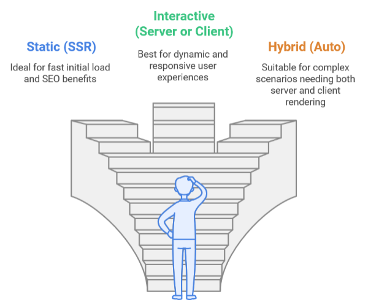

# Blazor for developers
**[German version](https://github.com/AlexNek/Blazor-for-You/blob/master/ForDevelopers/readme-de.md)**

## Overview
In this article, we won't go over another basic Blazor tutorial. Many resources already cover that topic. Instead, we'll focus on specific challenges that developers might face when using the new rendering modes in .NET 8 and later.

The article is not straightforward because there is a lot of information in it and I have tried to break it down.

For examples, visit the [example repository](https://github.com/AlexNek/BlazorNet8PlusExamples). You can also find a detailed [description of the examples](https://github.com/AlexNek/BlazorNet8PlusExamples/blob/master/readme-de.md). Alternatively, you can jump straight to the demos: [Demo 1](https://blazornet9rendermodes.azurewebsites.net) or [Demo 2](https://blazorauthentication202412.azurewebsites.net).

## Introduction to Blazor's New Rendering Modes

Blazor’s gotten some cool updates recently, giving developers new ways to render content in .NET 8 and beyond. Instead of sticking to one rigid approach, you can now mix things up based on what your app really needs.

Let’s break it down:  

- **Static (SSR)**: Think of this as delivering ready-made content directly to your users. The server sends fully-rendered HTML, so pages load quickly and look great for search engines. This is perfect for scenarios where speed and SEO matter most, like public-facing websites or blogs. 

- **Interactive (Server or Client)**: When your app needs to feel responsive and dynamic, interactive rendering steps in. It starts by sending pre-rendered content for a quick load, but then shifts into either client-side updates using WebAssembly or server-driven updates with Blazor Server. It’s ideal for dashboards or apps requiring constant user interaction.  

- **Hybrid (Auto)**: Not everything in an app fits neatly into one box, and that’s where hybrid mode shines. It blends the benefits of SSR and interactivity, starting with server-side content for speed and then switching to client-side rendering when needed. It’s a great choice for apps that demand both flexibility and performance.

While these modes offer a flexible approach, combining speed, interactivity, and control, they also increase development complexity.

## Choosing the Right Mode

Deciding how your app should render isn’t just about a single choice—it’s about understanding the unique needs of your application. With Blazor’s flexible rendering options, you can match each part of your app to its specific purpose, ensuring both performance and a great user experience.

### Render Modes Across Levels  

Blazor doesn’t lock you into one rendering strategy for the entire application. Instead, you can fine-tune it at three different levels:  

- **Application Level:** Define a default rendering strategy for the entire application. For example, if the majority of your pages prioritize quick loading and strong SEO performance, adopting SSR as the global default would be a practical choice. Additionally, you can fine-tune rendering approaches at other levels to suit specific needs.

- **Page Level:** Override the app-wide setting for specific pages. A page with complex interactivity, like a dashboard or live chat interface, might use an Interactive mode to ensure real-time updates.  

- **Component Level:** Take control of individual elements by assigning render modes to specific components. For example, a product page can use SSR for its layout but include an Interactive component for a shopping cart or review section.  

This structure gives you the power to adapt your app’s behavior at every level, balancing performance, scalability, and interactivity exactly where it’s needed.  

### Adaptability of Render Modes

Blazor gives you the option to choose between **fixed** and **variable** render modes, depending on how flexible you want your app to be:  

- **Fixed Mode:** Sticks to a single rendering method—like SSR or Interactive—throughout the app’s lifecycle. It’s straightforward and works well for static pages or areas with limited interactivity.  

- **Variable Mode:** Adapts dynamically, shifting rendering modes based on what’s happening in the app. For example, a product page might start with SSR for fast loading and SEO but switch to Interactive mode for features like adding items to a shopping cart.  

Variable modes are especially useful for apps where different parts serve very different purposes. Just keep in mind that managing these transitions smoothly is key to keeping the user experience seamless.  

### Factors to Consider When Choosing a Mode  

When choosing between SSR and Interactive modes, it’s essential to evaluate the specific needs of your application. Factors such as performance, scalability, user experience, and operational requirements play a crucial role in determining the best approach. You can find a detailed comparison of these core features, highlighting the capabilities, limitations, and scenarios best suited for each render mode **--> [here](factors-de.md) <--**.

#### Quick Comparison: SSR, Interactive, and Hybrid Modes
Here’s a **Quick Comparison** table summarizing the key differences between **SSR**, **Interactive**, and **Hybrid** modes. 

| Factor  | SSR (Static Server Render) | Interactive (Server) | Interactive (Client) | Hybrid (Auto)|
|---------|----------------------------|----------------------|----------------------|--------------|
| **Rendering Location**          | Server-side only                                                    | Server-side for initial load; browser client-side for interactivity (via Blazor Server) | Client-side rendering after initial server-side load (via WebAssembly) | Server-side for initial load; transitions to client-side (WebAssembly or Blazor Server) as needed |
| **Initial Load Speed**          | Fast (pre-rendered HTML sent directly)                             | Moderate (some setup needed for interactivity)           | Moderate (initial WebAssembly load time, but fast after that) | Fast (initially SSR, then client-side takes over)                |
| **Interactivity**               | Limited (static content until client-side takes over, if applicable)               | Full interactivity after client-side resources are loaded (via Blazor Server) | Full interactivity after the client-side resources are loaded (via WebAssembly) | Full interactivity after server-side initial load, with a transition to client-side interactivity |
| **SEO**                         | Excellent (fully rendered content sent to the client)              | Moderate (dynamic content requires additional handling for SEO)  | Moderate (dynamic content requires additional handling for SEO) | Good (initial SSR provides SEO benefit, but dynamic content requires client-side handling) |
| **State Management**            | Server-side (no client-side state)                                 | Server-side (SignalR for real-time updates) | Client-side (client manages most state via WebAssembly) | Mix of server and client-side state (depends on transition) |
| **Use Case**                    | Best for static or mostly-static websites (e.g., blogs, news sites) | Best for real-time dashboards, apps with high user interactivity | Best for single-page apps or apps requiring client-side interactivity and offline support | Best for apps needing both quick load and dynamic features (e.g., e-commerce) |
| **Scalability**                 | Limited by server capacity (every user request requires server processing and resources) | Scales better than SSR by reducing server load with server-side interactivity, but still relies on server for dynamic updates and socket connections for SignalR | Scales very well since most of the processing happens client-side, reducing server load significantly | Scales well, especially with client-side processing once the initial page is loaded, reducing server dependency |
| **Offline Support**             | Limited (requires a server connection)  |Limited (depends on server connection for real-time interactions)     | Full support for client-side with progressive enhancement  | Initially limited, then full support with client-side progressive enhancement after transition        |

### Developer Gotchas: Render Mode Pitfalls
Sometimes, developers may expect certain behaviors, but things work differently. 
Pay attention to these important points:

| Feature | SSR (Static Server Render)  | Interactive (Server) | Interactive (Client)  |
|---------|-----------------------------|----------------------|-----------------------|
| **OnInitializedAsync**  | Called once | Called twice: once during prerendering, and once when transitioning to interactivity | Called twice: once during prerendering, and once when transitioning to interactivity      |
| **OnAfterRenderAsync**  | Not Called | Called immediately after server rendering | Called immediately after client rendering       |
| **HttpContext Access**  | Fully available during server-side prerendering  | Limited to server-side logic.            | Not available                          |
| **NavigationManager**   | Limited to server-driven navigation                                 | Fully supported for SPA-like behavior  | Fully supported for SPA-like behavior  |
| **JavaScript Interop** | Limited (static JS possible, no dynamic interop) | Available after initial load (via SignalR) | Fully available (after WASM load) | Initially limited, then fully available after transition to client-side rendering |
| **RenderFragment**      | Static only during SSR  | Fully supported for page and application wide render mode | Fully supported for page and application wide render mode                                     |
| **Error Handling**      | Displays fallback content or error pages                            | Requires custom error boundaries   | Requires custom error boundaries                    |
| **DOM Cleanup Tasks**   | May need custom handling as DOM might not exist during disposal | Fully supported                                    | Fully supported                                  |

**Note:**
- **Prerendering in Interactive Modes**: In **Hybrid** and **Interactive Server** modes, **prerendering** is enabled by default, meaning that the component is first rendered on the server as static HTML. Then, once the WebAssembly or Blazor Server is loaded on the client side, the component becomes interactive and reinitializes. This results in **`OnInitializedAsync` being called twice**: once during **server-side prerendering** and again when the app transitions to interactivity on the client.

### Choosing the Right Mode - Summary
Choosing the right rendering mode in Blazor is a complex decision that requires careful consideration of multiple factors. While the all tables provided earlier in this chapter offer detailed comparisons across various aspects, it's important to remember that there's no one-size-fits-all solution. The best approach often involves a combination of rendering modes tailored to your application's specific needs. Consider factors like SEO, performance, and interaction complexity.

Remember that Blazor's flexibility allows you to mix and match rendering modes within a single application. Start by dividing your application into components and identifying which ones require interactivity and which can remain static. This process may require iteration to find the optimal balance.

#### Example Use Cases
| Scenario               | Recommended Mode                |
|----------------------------|-------------------------------------|
| Blog or news site          | SSR                                |
| Real-time dashboard        | Interactive                        |
| E-commerce product pages   | SSR for catalog, Interactive for cart |
| Single-page app (SPA)      | Interactive                        |
| Hybrid application         | Variable (SSR to Interactive)      |

## Component and Service Placement
When developing a Blazor application, deciding where to place components and services is crucial for ensuring optimal performance and security. The placement of these elements should be considered carefully to ensure your application runs efficiently and meets the necessary security requirements.

### Component Placement

When deciding where to place components in a Blazor application, consider the selecting render mode first. The table below summarizes the appropriate placements for different component types:

| Component Type    | Server  | Client | Shared  |
|-------------------|---------|--------|---------|
| **Server-Specific Logic**     | **Yes**: Place on the server for secure processing and access to server resources. | **No**: Not suitable for client-side due to reliance on server logic. | **No**: Only relevant in a server context.      |
| **Interactive UI Elements**   | **Yes**: SSR and Interactive Server rendering mode| **Yes**: Interactive Client and interactive Auto mode | **Yes**: Components without render mode defintion. Could be defined by using per instance |
| **Data Access Components**    | **Yes**: Recommended for security and direct access to databases. | **Yes (with caution)**: Use only if data can be securely accessed without exposing sensitive information. | **Yes**: Can be shared if used in both modes, but ensure security practices are followed. |
| **Authentication Components** | **Yes**: Essential for managing user sessions securely on the server. | **No**: Client-side authentication should be handled cautiously to avoid exposing sensitive data. | **Limited**: Shared components can manage authentication but should prioritize security. |

**Note**:
1. **Data Access Strategy**:
   - Evaluate where your data is stored and how it will be accessed; place data access components on the server when security is a priority.
   - If using APIs, consider whether those APIs can be accessed securely from the client.

2. **Shared Logic**:
   - For components that need to function in both environments, ensure they are designed to handle differences in execution context (e.g., accessing services or APIs).

3. **Static Components**:
   - Components without rendering mode (default SSR) and without specific service connection could be placed everywhere.

### Service Placement

When developing a Blazor application, the placement and registration of services is also crucial.

#### Server-Side Services
Server-side services are ideal for handling sensitive data and business logic securely. These services should always be registered on the server to minimize exposure to potential vulnerabilities. They can manage tasks such as authentication, data access, and any operations requiring secure processing. 

**Prerendering Consideration:** When using prerendering, remember that server-side services are accessible during the initial rendering phase. However, client-side services are not available at this stage, which means you must register server-side version of client-services for you client components.

#### Transient and Scoped Services
Transient and scoped services can be registered on either the server or client based on their usage needs:

- **Server Registration:** If these services are intended for operations that involve data access or require secure handling of user information, they should be registered on the server.
- **Client Registration:** If the services are only needed for client-side interactions (e.g., UI state management), they can be registered on the client.

This flexibility allows developers to optimize resource usage and ensure that each service is placed where it will be most effective.

#### Singleton Services
Singleton services are best registered on the server to maintain a single instance throughout the application's lifecycle. This approach ensures consistent behavior across sessions and reduces overhead by avoiding multiple instances of the same service.

**Client Consideration:** Registering singleton services on the client is generally not recommended due to potential state management issues. If you need shared state across different parts of your application, consider using a server-side singleton instead.

### Singleton Services and Rendering Transitions  

In Blazor, **singleton services** are used to maintain a single instance throughout the application's lifecycle. However, they behave differently when switching between rendering modes, such as from server-side rendering (SSR) to client-side rendering (WebAssembly).

- **During Initial Rendering:** When a Blazor component is first rendered on the server, **singleton services** registered on the server are available. This helps maintain shared resources, like authentication or logging, across different components.

- **Prerendering Considerations:** If prerendering is enabled, the component is first rendered on the server before being sent to the client. During this phase, **server-side singleton services** can be used, but **client-side services** won’t be available until the page fully loads on the client. This means that during the early phase, some services may not be accessible, so you must ensure your app can handle this by relying on server-side services until the client-side is ready.

- **Transitioning Between Render Modes:** When switching from SSR to Interactive Server or Interactive Client modes, **server-side singleton services** remain available throughout the app. However, when moving to client-side rendering (like Blazor WebAssembly), those server-side services are no longer directly accessible. To interact with server data, you’ll need to use APIs or other methods.

- **State Management:** Singleton services can help manage app state, but you need to ensure that state is transferred or synchronized properly when switching between server-side and client-side rendering. If this isn’t done, state can get out of sync, causing errors or inconsistent behavior.

### Important Considerations for Developers

- **Scalability and Resource Usage:** When using singleton services in Blazor Server applications with many concurrent users, developers must be cautious about resource consumption and thread safety. Singleton services are shared across all user sessions, which can lead to increased memory usage and potential performance bottlenecks.

- **Thread Safety:** Since multiple users can access the same singleton service simultaneously, it’s crucial to implement thread-safe practices to prevent data inconsistencies.

- **State Synchronization:** Changes made in a singleton service affect all users. Developers should implement mechanisms to ensure that state changes are communicated across different user sessions effectively.

- **Lifecycle Management:** Singleton services persist for the entire application lifetime. Proper cleanup and resource management are necessary to avoid holding onto resources longer than needed.

## Helpful links
If you're looking to dive deeper into Blazor and the various rendering modes, here are some useful resources to guide you through the concepts and implementations:

- [ASP.NET Core Blazor render modes](https://learn.microsoft.com/en-us/aspnet/core/blazor/components/render-modes?view=aspnetcore-9.0)
- [Blazor .NET 8 Server-side Rendering (SSR)](https://akifmt.github.io/dotnet/2024-01-16-blazor-.net8-server-side-rendering-ssr/)
- [Everything New in .NET 9: The Ultimate Developer's Guide](https://dev.to/bytehide/everything-new-in-net-9-the-ultimate-developers-guide-331e)
- [Black Belt Blazor - Differences between Interactive Blazor and Static Blazor](https://github.com/devessenceinc/BlackBeltBlazor)
- [Blazor and .NET 8: How I Built a Fast and Flexible Website](https://jeffreyfritz.com/2024/02/blazor-and-net-8-how-i-build-a-fast-and-flexible-website/)
- [Build your first web app with ASP.NET Core using Blazor](https://dotnet.microsoft.com/en-us/learn/aspnet/blazor-tutorial/intro)
- [Creating A Step-By-Step End-To-End Database Server-Side Blazor Application](https://blazorhelpwebsite.com/ViewBlogPost/34)

## Conclusion

Selecting the optimal render mode in Blazor is a crucial decision that significantly impacts your application's performance, user experience, and long-term viability. The choice between Server-Side Rendering (SSR), Interactive Server, Interactive Client, and Auto render modes requires careful consideration and strategic planning.

Key takeaways to consider:

1. **Flexibility is Key:** Utilize Blazor's mix-and-match approach to tailor render modes for different application parts.
2. **Focus on Critical Components:** Identify and prioritize key areas of your application to optimize performance.
3. **Iterative Improvement:** Be prepared to refine your approach based on user feedback and application behavior.
4. **Balance Needs:** Weigh immediate performance requirements against future scalability.
5. **Component Placement Matters:**  Strategically position components and services for optimal performance, security, and demand.
6. **User-Centric Design:** Always prioritize the end-user experience in your architectural decisions.
7. **Adaptability is Essential:** Stay ready to evolve your rendering strategies as your application grows.

By applying these principles, you can create responsive web applications that meet current needs while remaining adaptable for future challenges. Your choice of render mode should align with your app’s goals, whether prioritizing speed, interactivity, or a balance of both. With thoughtful planning and Blazor’s flexible architecture, you can build high-performing applications that deliver excellent user experiences.
