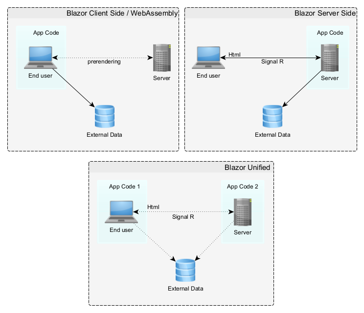

# Teil 1: Blazor für Manager

## Überblick

Blazor, das Web-Framework von Microsoft für den Aufbau interaktiver Client-Weboberflächen mit .NET, hat in den letzten Jahren erheblich an Bedeutung gewonnen. Als Manager ist es wichtig, die Stärken, Schwächen und idealen Anwendungsfälle zu verstehen, um fundierte Entscheidungen über den Technologie-Stack treffen zu können.

## Was ist Blazor?

Im Kern ist Blazor Microsofts Antwort auf die Frage: „Können wir Weboberflächen mit C# anstelle von JavaScript erstellen?“ Die Antwort lautet eindeutig ja. Blazor ermöglicht es Entwicklern, ihre C#-Kenntnisse zu nutzen, um sowohl client- als auch serverseitige Webanwendungen zu erstellen und so die Lücke zwischen der .NET-Entwicklung und modernen Webtechnologien zu schließen.

Blazor bietet zwei primäre Hosting-Modelle:

1. **Blazor WebAssembly**: Diese clientseitige Lösung läuft vollständig im Browser und nutzt WebAssembly, um .NET-Code direkt auf dem Client auszuführen.

2. **Blazor Server**: Eine serverseitige Implementierung, bei der die UI-Updates über eine SignalR-Verbindung verwaltet werden und ein schlanker Client im Browser verbleibt.

.NET 8.0 führt ein [einheitliches Rendering-Modell](net8ex-de.md) ein, das Leistungsprobleme adressiert und eine größere Flexibilität in der Anwendungsarchitektur bietet:

 - **Blazor Unified**: Ermöglicht eine Mischung aus server- und clientseitigem Rendering innerhalb derselben Anwendung.
> Hinweis: In diesem Artikel verwenden wir die Bezeichnung `Blazor Unified` als Kurzform für das `Unified Full-Stack Model` oder `Full Stack Web UI with Blazor`. Dieses Modell ermöglicht es, verschiedene unterstützte Rendering-Modi (Client-Rendering, serverseitiges Rendering und statisches Rendering) zu wählen und zwischen ihnen auf Komponenten- oder Seitenebene innerhalb einer Anwendung zu wechseln.

  
*Abb.: Vereinfachte Darstellung der Blazor-Hosting-Modelle*

## Unterschiede zwischen Blazor Client, Blazor Server und Blazor Unified

### Blazor Client / WebAssembly

Blazor WebAssembly-Anwendungen laufen vollständig im Browser des Benutzers, wobei C#-Code und .NET-Bibliotheken heruntergeladen und clientseitig ausgeführt werden.

**Vorteile:**

- **Offline-Fähigkeiten:** Kann nach dem Herunterladen ohne permanente Server-/Internetverbindung funktionieren.
- **Reaktionsschnelle Benutzeroberfläche:** Interaktionen können sehr schnell sein, ohne Server-Roundtrips.
- **Reduzierte Serverlast:** Die Verarbeitung wird auf den Browser des Clients ausgelagert.
- **Bereitstellung auf statischen Dateiservern oder CDNs:** Blazor WebAssembly kann auf statischen Dateiservern oder Content Delivery Networks (CDNs) bereitgestellt werden, was Flexibilität bei Hosting und Bereitstellung bietet.

**Allgemeine WASM-Nachteile:**
- **Eingeschränkte Browser-Kompatibilität:** WebAssembly hängt von der Browser-Unterstützung ab. Obwohl es in modernen Browsern weitgehend unterstützt wird, können ältere Versionen eine eingeschränkte Kompatibilität aufweisen, was die Funktionalität für Benutzer auf diesen Plattformen beeinträchtigen kann.
- **Clientseitige Sicherheitsbedenken:** Da der Code clientseitig ausgeführt wird, sind sensible Logik oder Daten potenziell exponiert. Es ist wichtig, angemessene Authentifizierungs- und Autorisierungsmechanismen zu implementieren und sensible Operationen nicht direkt im clientseitigen Code zu behandeln.

**Blazor-spezifische Nachteile:**

- **Längere anfängliche Ladezeiten:** Das Herunterladen der gesamten Anwendung und der .NET-Laufzeitumgebung kann das anfängliche Laden verlangsamen. Dies ist besonders bei öffentlich zugänglichen Websites problematisch. Hier sind der erste Eindruck und das Engagement der Nutzer entscheidend.
- **Leistungs-Kompromisse:** Blazor WebAssembly kann bei CPU-intensiven Aufgaben langsamer sein als native .NET-Anwendungen. Obwohl .NET 8 Optimierungen wie Ahead-of-Time (AOT)-Kompilierung einführt, um die Laufzeitleistung zu verbessern, kann dies auch die Gesamtgröße der Anwendung erhöhen.
- **Eingeschränkter API-Zugriff:** Nicht alle .NET-APIs sind in der Browser-Umgebung verfügbar.
 >Hinweis: Die meisten System.Security.Cryptography-APIs werden in Blazor WebAssembly aufgrund von Browser-Sandbox-Einschränkungen, fehlenden nativen kryptografischen Primitiven, Leistungsüberlegungen, Sicherheitsbedenken und der Präferenz für die Verwendung von browsereigenen kryptografischen APIs nicht unterstützt.

### Blazor Server

Blazor Server-Anwendungen werden hauptsächlich auf dem Server ausgeführt, wobei UI-Aktualisierungen über eine SignalR-Verbindung an den Browser des Clients kommuniziert werden.

**Vorteile:**

- **Schnelles anfängliches Laden:** Kleinere Download-Größe führt zu schnelleren anfänglichen Seitenladungen.
- **Voller Zugriff auf Serverressourcen:** Direkter Zugriff auf serverseitige Ressourcen wie Datenbanken und Dateisysteme.
- **Verbesserte Sicherheit:** Sensible Logik und Daten befinden sich auf dem Server, was ein höheres Maß an Sicherheit im Vergleich zur clientseitigen Ausführung bietet.
- **Reduzierte Client-CPU-Last:** Blazor Server übernimmt den Großteil des Renderings und der Zustandsverwaltung auf dem Server, was die Verarbeitungsarbeit für Client-Geräte reduziert. Dies ist besonders hilfreich für Benutzer mit älteren oder weniger leistungsfähigen Geräten.

**Nachteile:**

- **Ständige Verbindung erforderlich:** Eine persistente Verbindung zwischen Browser und Server ist notwendig, was zu Skalierbarkeitsherausforderungen bei einer großen Anzahl gleichzeitiger Benutzer führen kann und möglicherweise nicht für Offline-Szenarien geeignet ist.
- **Umgang mit langen Benutzerabwesenheiten:** Blazor Server kann für Benutzer, die lange abwesend sind, aufgrund möglicher Sitzungs-Timeouts, Datensynchronisationsproblemen und einer beeinträchtigten Benutzererfahrung herausfordernd sein.
- **Erfordert ASP.NET Core-Hosting:** Blazor Server-Anwendungen sind auf ASP.NET Core als serverseitige Laufzeitumgebung angewiesen. Dies könnte für Projekte, die bereits andere serverseitige Technologien verwenden, nicht ideal sein.
- **Potenzielle Latenz:** UI-Interaktionen beinhalten Serverkommunikation, was möglicherweise die Reaktionsfähigkeit beeinträchtigt.

### Blazor Unified

Das Blazor Unified Rendering-Modell, eingeführt in .NET 8.0, bietet eine leistungsstarke Möglichkeit, Blazor Server- und WebAssembly-Komponenten innerhalb einer einzigen Anwendung zu kombinieren. Dieser einheitliche Ansatz gibt Entwicklern größere Flexibilität bei der Gestaltung optimierter Webanwendungsarchitekturen.

**Vorteile:**

- **Flexibilität:** Entwickler können den am besten geeigneten Rendering-Modus für verschiedene Teile der Anwendung wählen.
- **Optimierte Leistung:** Kann die Vorteile sowohl des Server- als auch des WebAssembly-Modells nutzen, wo es angemessen ist.
- **Progressive Verbesserung:** Anwendungen können mit serverseitigem Rendering beginnen und zu clientseitiger Ausführung übergehen, wenn WebAssembly verfügbar ist.
- **Verbesserte Skalierbarkeit:** Verteilung der Last auf Server und Clients, was die Skalierbarkeit für Anwendungen mit hoher Benutzerlast verbessert.
- **Nahtlose Benutzererfahrung:** Bietet eine reibungslose und reaktionsschnelle Benutzererfahrung, selbst in Szenarien mit begrenzter Netzwerkverbindung.

**Überlegungen:**

- **Komplexität:** Die Verwaltung von sowohl server- als auch clientseitiger Logik in einer einzigen Anwendung kann zusätzliche Komplexität in die Architektur und den Entwicklungsprozess Ihrer Anwendung einbringen. Auch das Mischen verschiedener Rendering-Modi zusammen mit der Zustandsverwaltung ist keine einfache Aufgabe.
- **Datenzugriff:** Erfordert sorgfältiges Design, um den Datenzugriff über Server- und Client-Komponenten hinweg konsistent zu handhaben.
- **Entwicklungserfahrung:** Entwickler müssen mit beiden Paradigmen, Blazor Server und WebAssembly, vertraut sein.

### Leistung und Skalierbarkeit

- Blazor Server bietet gute anfängliche Leistung, kann aber mit zunehmender Benutzerzahl Skalierbarkeitsherausforderungen begegnen. Während spezifische Zahlen je nach Anwendungskomplexität und Serverressourcen stark variieren können, hat Microsoft gezeigt, dass Blazor Server [Tausende (5.000-20.000)](https://devblogs.microsoft.com/dotnet/blazor-server-in-net-core-3-0-scenarios-and-performance/) gleichzeitige Benutzer handhaben kann. Für präzise Kapazitätsplanung wird empfohlen, Lasttests durchzuführen, die spezifisch für Ihre Anwendung und Infrastruktur sind, zum Beispiel [SignalR](https://learn.microsoft.com/en-us/azure/azure-signalr/signalr-concept-performance).

- Blazor WebAssembly bietet nach dem anfänglichen Laden ausgezeichnete Skalierbarkeit und Reaktionsfähigkeit, aber seine Startzeit kann aufgrund von Faktoren wie Anwendungskomplexität, Netzwerkbedingungen, Gerätehardware und Bereitstellungskonfiguration von wenigen Sekunden bis zu mehreren zehn Sekunden variieren.

- Blazor Hybrid ermöglicht die Optimierung der Leistung, indem für jede Komponente das geeignete Modell gewählt wird.

### Server-Side Rendering (SSR) in Blazor

Server-Side Rendering (SSR) in Blazor, besonders mit .NET 8, bietet mehrere Vorteile und Konfigurationsmöglichkeiten für Webanwendungen:

1. **Verbesserte Leistung und SEO**:
   - SSR ermöglicht das anfängliche Rendern einer Blazor-Anwendung auf dem Server, was zu schnelleren Ladezeiten führt, da der Browser vollständig gerenderte HTML-Inhalte erhält.
   - Dieser Ansatz verbessert die SEO, da Suchmaschinen den statischen HTML-Inhalt effektiver indexieren können im Vergleich zu clientseitig gerenderten Anwendungen.

2. **Standardmodus in .NET 8**:
   - In .NET 8 ist SSR der Standard-Renderingmodus für neue Blazor-Anwendungen. Diese Verschiebung spiegelt den Trend zur Nutzung serverseitiger Fähigkeiten für bessere Leistung und Effizienz wider.
 >Hinweis: Nicht alle Blazor-Komponentenbibliotheken unterstützen SSR vollständig. Während SSR begrenzte Benutzerinteraktionen ähnlich wie natives HTML ermöglicht (z.B. `<a>`-Links, Formulare), benötigen bestimmte Bibliotheken einen spezialisierten Renderingmodus für das anfängliche Rendering, der sich von SSR unterscheiden kann.

3. **Anwendungsfälle**:
   - SSR ist besonders vorteilhaft für Anwendungen, die statische Daten verarbeiten oder schnelle Seitenladezeiten erfordern, wie z.B. Geschäftsanwendungen oder Online-Shops.
   - Es reduziert die Rechenbelastung auf Client-Geräten, was es für Geräte mit begrenzten Ressourcen geeignet macht.

Insgesamt bietet SSR in Blazor ein robustes Framework für den Aufbau leistungsfähiger und SEO-freundlicher Webanwendungen, indem es die Serverfähigkeiten nutzt, um vorgerenderte Inhalte effizient bereitzustellen.

## Vorteile von Blazor für .NET-erfahrene Teams

Blazor bietet mehrere Vorteile für Teams, die bereits mit dem .NET-Ökosystem vertraut sind:

- **Einheitlicher Tech-Stack:** Blazor ermöglicht es Entwicklern, C# sowohl für Front-End- als auch für Back-End-Entwicklung zu verwenden, was potenziell die Produktivität und Codewiederverwendung erhöht. Dies kann besonders vorteilhaft für Organisationen sein, die bereits in das .NET-Ökosystem investiert haben. Für Teams, die bereits mit C# und dem .NET-Framework vertraut sind, kann die Einführung von Blazor die Entwicklungsprozesse rationalisieren. Dies eliminiert die Notwendigkeit, zwischen verschiedenen Sprachen und Frameworks zu wechseln, und ermöglicht es Entwicklern, ihre bestehenden Fähigkeiten sowohl für die Client- als auch für die Server-Entwicklung zu nutzen.

- **Großes .NET-Ökosystem:** Entwickler können das umfangreiche .NET-Ökosystem, einschließlich Bibliotheken und Tools, für die Webentwicklung nutzen. Dies bedeutet, dass die Teams auf eine Vielzahl bestehender Ressourcen zugreifen können, einschließlich Bibliotheken, Frameworks und Tools, die auf dem .NET-Ökosystem basieren.

- **Leistung:** Insbesondere Blazor Server kann eine hervorragende Leistung bieten, besonders für Anwendungen mit komplexer UI-Logik. Blazor Server führt die Anwendungslogik auf dem Server aus, was potenziell zu schnelleren Ladezeiten und einer effizienteren Handhabung komplexer UI-Interaktionen führt.

- **Plattformübergreifende Entwicklung:** Blazor unterstützt plattformübergreifende Entwicklung und ermöglicht Teams, Web-, Desktop- und mobile Anwendungen mit demselben Codebase zu erstellen. Dies kann ein bedeutender Vorteil für Teams sein, die mehrere Plattformen mit ihren Anwendungen ansprechen möchten.

Insgesamt bietet Blazor für Teams, die bereits gut mit der .NET-Umgebung vertraut sind, einen reibungslosen Übergang in die Webentwicklung, indem sie ihre bestehenden Fähigkeiten und Ressourcen nutzen können, um leistungsfähige und funktionsreiche Anwendungen zu erstellen.

## Wann man Blazor vermeiden sollte

Obwohl Blazor ein leistungsfähiges Framework ist, ist es möglicherweise nicht für jedes Szenario die beste Wahl, insbesondere wenn Sie Folgendes benötigen:

1. **Öffentlich zugängliche Websites**: Wo schnelle anfängliche Ladezeiten entscheidend sind. Trotz der in .NET 8 implementierten Verbesserungen zur Optimierung der Startzeiten kann Blazor WebAssembly beim anfänglichen Laden, insbesondere bei größeren Anwendungen, weiterhin langsam sein. Wenn Sie eine große Anzahl von Benutzern bedienen müssen und Blazor Server aufgrund seiner Skalierungsbeschränkungen nicht verwenden können, oder wenn Offline-Funktionalität wesentlich ist und Blazor Hybrid sie nicht bereitstellen kann, sollten Sie alternative Frameworks in Betracht ziehen.

2. **Hochkomplexe Single-Page-Anwendungen (SPAs)**: Blazor, obwohl in der Lage, SPAs zu handhaben, ist möglicherweise nicht die leistungsfähigste Wahl für extrem komplexe Anwendungen mit vielen Komponenten und Interaktionen. In solchen Fällen könnten traditionelle JavaScript-Frameworks bessere Leistungs- und Optimierungsmöglichkeiten bieten.

3. **Echtzeit-Anwendungen mit strengen Latenzanforderungen**: Während Blazor Server Echtzeit-Fähigkeiten bietet, erfüllt es möglicherweise nicht die strengen Latenzanforderungen von Anwendungen wie Online-Gaming oder Finanzhandel. In diesen Szenarien könnten Technologien wie WebSockets oder benutzerdefinierte Protokolle besser geeignet sein.

4. **Mobile App-Entwicklung**: Blazor ist in erster Linie für die Webentwicklung konzipiert und bietet keine direkte Unterstützung für den Aufbau nativer mobiler Apps. Während Sie Tools wie Blazor Hybrid verwenden können, um mobile Apps zu erstellen, bietet es möglicherweise nicht das gleiche Maß an Leistung und nativen Funktionen wie ein dediziertes mobiles App-Framework.

**Zusätzliche Überlegungen:**

- **Entwicklerexpertise**: Wenn Ihr Team keine Erfahrung mit .NET oder C# hat, könnte das Erlernen von Blazor eine steilere Lernkurve haben im Vergleich zu JavaScript-basierten Frameworks. Für Teams, die hauptsächlich Erfahrung mit JavaScript-Frameworks haben, stellt Blazors Verwendung von C# für die Front-End-Entwicklung eine Herausforderung dar. Diese Teams müssen erhebliche Zeit und Ressourcen in das Erlernen von C# und Blazor-spezifischen Konzepten investieren, um Kompetenz zu erlangen. Diese Lernkurve kann Projektzeitpläne verzögern und Entwicklungskosten erhöhen, insbesondere wenn dem Team vorherige Erfahrung mit dem .NET-Ökosystem fehlt.

- **Community und Ökosystem**: Während die Blazor-Community wächst, ist sie möglicherweise nicht so ausgereift oder umfangreich wie die einiger etablierter JavaScript-Frameworks. Dies könnte die Verfügbarkeit von Drittanbieter-Bibliotheken, Tools und Ressourcen beeinflussen.

## Wann man Blazor in Betracht ziehen sollte

Blazor, insbesondere im Hybrid-Modus, kann für viele Webentwicklungsprojekte eine starke Wahl sein. Hier sind einige Szenarien, in denen Blazor gut geeignet sein könnte:

1. **Progressive Web Applications (PWAs):** Blazor Hybrid kann in Kombination mit einer Progressive Web App (PWA)-Strategie eine nahezu native Erfahrung sowohl auf Web- als auch auf mobilen Plattformen liefern. Dies ermöglicht es Ihnen, ein breiteres Publikum zu erreichen, ohne separate native Apps entwickeln zu müssen. Blazor Hybrid kombiniert clientseitiges Rendering für Interaktivität und serverseitiges Rendering für SEO und anfängliche Ladezeiten. Nutzen Sie SSR und Zustandsverwaltung für eine verbesserte Benutzererfahrung.

2. **Plattformübergreifende Entwicklung:** Wenn Sie Anwendungen entwickeln müssen, die auf Web-, Desktop- und mobilen Geräten laufen, kann Blazor eine einheitliche Codebasis und Entwicklungserfahrung bieten. Dies kann die Entwicklungszeit und Wartungskosten reduzieren.

3. **Single-Page Applications (SPAs):** Blazor eignet sich gut für den Aufbau von SPAs, da es die clientseitige Darstellung von Komponenten ermöglicht und so eine reaktionsfähigere und interaktivere Benutzererfahrung bietet.
> Hinweis: Blazor kann eine effektive Wahl für moderat komplexe SPAs sein, insbesondere wenn vorhandene .NET-Kompetenzen oder Codebasen genutzt werden können. Für hochkomplexe SPAs mit strengen Anforderungen an Leistung und Skalierbarkeit könnten jedoch etablierte JavaScript-Frameworks mehr Flexibilität und optimierte Lösungen bieten.

4. **Bestehende .NET-Codebasen:** Wenn Sie eine bestehende .NET-Codebasis haben, kann Blazor eine natürliche Erweiterung sein. Sie können Ihre vorhandenen .NET-Fähigkeiten und -Bibliotheken nutzen, um Webanwendungen zu erstellen.

5. **Datengesteuerte Anwendungen:** Blazors Datenbindungsfunktionen machen es einfach, mit Daten zu arbeiten und die Benutzeroberfläche automatisch zu aktualisieren, wenn sich Daten ändern. Dies ist besonders nützlich für Anwendungen, die große Datensätze anzeigen und manipulieren.

6. **Komponentenbasierte Entwicklung:** Blazors komponentenbasierte Architektur fördert die Wiederverwendbarkeit und Wartbarkeit des Codes. Sie können benutzerdefinierte Komponenten erstellen, die Funktionalität kapseln und in verschiedenen Teilen Ihrer Anwendung verwendet werden können.

7. **Microsoft-Unterstützung:** Als Microsoft-Produkt profitiert Blazor von der Unterstützung und Investition des Unternehmens. Dies kann Vertrauen in die langfristige Lebensfähigkeit des Frameworks geben.

## Hilfreiche Links (alle Links auf Englisch)

### Artikel

- [Blazor – Warum Blazor für Ihre Webentwicklung wählen](https://www.zartis.com/why-to-choose-blazor-for-your-web-development-why-not/) - Dieser Artikel diskutiert die Vorteile der Verwendung von Blazor für die Webentwicklung und hebt seine Integration mit .NET, die einfache Verwendung für C#-Entwickler und seine Fähigkeit, interaktive Webanwendungen zu erstellen, hervor.

- [Blazor-Grundlagen für Anfänger](https://daily.dev/blog/blazor-basics-for-beginners) - Ein anfängerfreundlicher Leitfaden, der Blazor vorstellt und seine wichtigsten Vorteile, Architektur und einen schrittweisen Ansatz zum Erstellen Ihrer ersten Anwendung mit C# und .NET behandelt.

- [Ist Blazor die Zukunft von allem Web?](https://www.telerik.com/blogs/is-blazor-future-everything-web) - Dieser Blogbeitrag untersucht Blazors Potenzial, die Webentwicklung neu zu gestalten, und diskutiert seine einzigartigen Funktionen und wie es sich mit traditionellen JavaScript-Frameworks vergleicht.

- [Warum mit Blazor modernisieren? Eine Gewinnstrategie für Ihre nächste Anwendung](https://www.telerik.com/blogs/why-modernize-blazor-winning-strategy-next-application) - Dieser Artikel skizziert die strategischen Vorteile der Modernisierung von Anwendungen mit Blazor und betont Leistungsverbesserungen und Kompatibilität mit bestehenden .NET-Technologien.

- [Sollten wir Blazor für unsere App in Betracht ziehen?](https://dev.to/ipazooki/should-we-consider-blazor-for-our-app-3lob) - Eine durchdachte Untersuchung, ob Blazor eine geeignete Wahl für die Anwendungsentwicklung ist, wobei seine Vorteile gegen potenzielle Nachteile abgewogen werden.

- [Blazor vs. Angular in der Webentwicklung](https://radixweb.com/blog/blazor-vs-angular) - Dieser Vergleich hebt die Unterschiede zwischen Blazor und Angular hervor und hilft Entwicklern zu entscheiden, welches Framework am besten zu ihren Projektanforderungen passt.

- [Wahl zwischen Blazor Server oder WebAssembly](https://baldbeardedbuilder.com/blog/choosing-between-blazor-server-or-web-assembly/) - Ein praktischer Leitfaden, der Entwicklern hilft, zwischen Blazor Server und WebAssembly-Hosting-Modellen basierend auf ihren spezifischen Anwendungsanforderungen zu wählen.

- [Blazor | Was es ist und warum wir es verwenden sollten](https://www.c-sharpcorner.com/article/blazor-what-it-is-why-should-we-use-it/) - Ein einführender Artikel, der erklärt, was Blazor ist, seine Kernfunktionalitäten und warum Entwickler es für moderne Webanwendungen in Betracht ziehen sollten.

- [Warum Blazor für Ihr Projekt besser sein könnte als JavaScript?](https://softiq.io/why-blazor-might-be-better-for-your-project-than-javascript/) - Dieser Artikel diskutiert Szenarien, in denen Blazor Vorteile gegenüber JavaScript-Frameworks bieten kann, mit Fokus auf Leistung und Entwicklerproduktivität.

- [ASP.NET Core Blazor-Hosting-Modelle](https://learn.microsoft.com/en-us/aspnet/core/blazor/hosting-models?view=aspnetcore-8.0) - Offizielle Dokumentation von Microsoft, die die verschiedenen in Blazor verfügbaren Hosting-Modelle detailliert beschreibt, einschließlich Server- und WebAssembly-Optionen, um Entwicklern bei fundierten Entscheidungen zu helfen.

- [Blazor: Leistungsstarkes Framework, das Unternehmen befähigt, robuste und skalierbare Webanwendungen zu erstellen](https://walkingtree.tech/blazor-powerful-framework-empowering-enterprises-to-build-robust-and-scalable-web-applications/): Dieser Artikel hebt Blazors Fähigkeiten beim Erstellen interaktiver und skalierbarer Webanwendungen mit C# hervor. Er diskutiert seine komponentenbasierte Architektur und Hosting-Modelle und betont seine Vorteile für die Unternehmensentwicklung.

### Videos

- [Was kommt als Nächstes für ASP.NET Core & Blazor .NET 9.0](https://www.youtube.com/watch?v=o0CWssf8TFw) - von Daniel Roth. Dieses Video untersucht die zukünftigen Entwicklungen und Verbesserungen, die in ASP.NET Core und Blazor mit der kommenden .NET 9.0-Veröffentlichung erwartet werden, mit Fokus auf neue Funktionen und Verbesserungen.

- [Was ist neu in Blazor für .NET 8](https://www.youtube.com/watch?v=QD2-DwuOfKM) - von Daniel Roth. In dieser Präsentation hebt Daniel Roth die wichtigsten Funktionen hervor, die in Blazor mit .NET 8 eingeführt wurden, einschließlich verbesserter Rendering-Optionen und erweiterter Navigationsfähigkeiten.

- [Blazor auf .NET 8 - Zehn Gründe, warum Blazor auf .NET 8 ein Game Changer ist](https://www.youtube.com/watch?v=VWwZrDA8om0). Dieses Video skizziert zehn bedeutende Gründe, die Blazor auf .NET 8 zu einem transformativen Framework für die Webentwicklung machen, und betont seine Leistungs- und Benutzerfreundlichkeitsverbesserungen.

- [Blazor WebAssembly in .NET 8 - Warum es immer noch extrem wertvoll ist](https://www.youtube.com/watch?v=NJ9Kz3M8KzE). Diese Diskussion konzentriert sich auf die anhaltende Relevanz von Blazor WebAssembly in .NET 8 und detailliert seine Vorteile und wie es Entwicklern weiterhin Wert bietet, die clientseitige Anwendungen erstellen.

## Fazit

Blazor bietet mit seinen Fortschritten in .NET 8.0 eine überzeugende Alternative zu traditionellen JavaScript-Frameworks für .NET-Entwickler. Seine einzigartigen Vorteile, einschließlich Spracheinheit, Leistung und Flexibilität, machen es zu einem starken Kandidaten für moderne Webentwicklung, insbesondere für Organisationen, die bereits in das .NET-Ökosystem investiert haben.

Es ist jedoch [wichtig zu bewerten](consideration-de.md), ob es für Ihr spezifisches Projekt, Ihre Teamfähigkeiten und Ihre Risikobereitschaft geeignet ist. Während Blazors wachsende Fähigkeiten beeindruckend sind, ist es entscheidend, seine Stärken gegen die einzigartigen Anforderungen Ihres Projekts abzuwägen.

Indem Sie diese Faktoren sorgfältig berücksichtigen, können Sie feststellen, ob Blazor die richtige Wahl ist, um Ihre Webentwicklungsinitiativen voranzutreiben.

